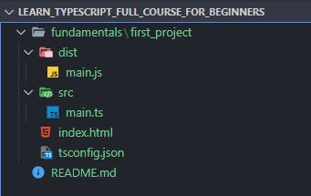

# Learn TypeScript - Full Course for Beginners

Alexander Kochergin Youtube course https://www.youtube.com/MonsterlessonsAcademy

## Notes

- `npm install -g typescript-language-server`

- `npx tsc -v`

- Typescript files cant be executed in browser

- `npx tsc main.ts`

  - generates a js file (transpiled to js ES3 - works in every browser)
  - that's why const and let become var after generation

- `npx tsc main.ts -w`

- **ts.config.json**

  - ```json
    {
      "compilerOptions": {
        "rootDir": "./src",
        "outDir": "./dist",
      }
    }
    ```

  - 

  - `npx tsc -w`

- Interfaces

  - Creating objects

  - There is no entity in JS

  - ```typescript
    interface UserInterface { // or IUser
      name: String,
      age: number,
      email?: String, // non-mandatory property
      getMessage(): string,
    }
    
    const user3: UserInterface = {
      name: "Jack",
      age: 30,
      getMessage() {
        return "Hello " + name;
      }
    }
    
    console.log(user3.getMessage());
    ```

  - ```typescript
    const user: {name: string, age: number} = {
      name: "Otávio",
      age: 20,
    }
    ```

- Union & Type alias

  - Union

    - Operator to combine types. One type OR another.

    - ```ts
      let errorMessage:  string | null = null;
      
      let newUser: UserInterface2 | null = null;
      
      let someProp: string | number | null | undefined | string[] | object; // bad code
      ```

  - Type aliases

    - Types and Interfaces always start with capital letter

- Any, never, void, unknown

  - Void: a set of undefined and null

    - ```ts
      const doSomething = (): void => {
          console.log('Hi');
      }
      
      let foo: void = null;
      foo = undefined;
      ```

  - Any: Turns off typescript check. Should be avoided.

    - ```ts
      let foo2: any = "foo";
      console.log(foo2.hi());
      ```

  - Never: function that does not reach its end

    - ```ts
      const doSomething2 = (): never => {
          console.log("Hi hi");
          throw "never";
      }
      ```

  - Unknown: as any, you can assign to this type any value.

    - ```ts
      let vAny: any = 10;
      let vUnknown: unknown = 10;
      
      let s1: string = vAny;
      console.log(vAny.foo());
      
      // let s2: string = vUnknown; // wrong
      let s2: string = vUnknown as string; // correct
      ```

  - Type Assertion: keyword `as`

    - ```ts
      let s3: string = vUnknown as string;
      let pageNumber: string = '1';
      let numericPageNumber2: number = pageNumber as unknown as number; 
      ```

- Typescript working with DOM

  - Typescript does not know anything about markup - usage is only with types in code.

  - ```ts
    const specificElement = document.querySelector('.foo') as HTMLInputElement;
    
    const target = event.target as HTMLInputElement;
    ```

- Working with classes

  - Classes are sugar around prototypes.

  

  
